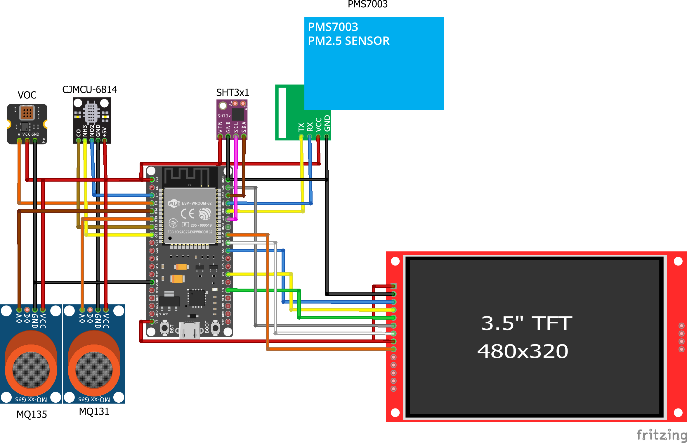

# 🍃 Breezi Air Purifier - Smart IoT Environment Monitor

 

---

## 🇬🇧 English Version

Breezi is a comprehensive Smart Air Purifier and Environmental Monitoring system. It operates on a distributed master-slave architecture, featuring a central ESP32 for high-performance UI rendering, sensor data aggregation, and web hosting, alongside an ESP8266 slave node for executing hardware control commands (Fan/Mist).

### 🚀 Key Features
* **Distributed Architecture:** ESP32 acts as the central server processing logic and hosting the Web UI, while an ESP8266 node polls data to control the physical relay.
* **Comprehensive Environmental Sensing:** Reads Temp/Humidity (SHT31) and utilizes a sophisticated array of analog gas sensors (MQ131, MQ135, CJMCU-6814) combined with a PMS7003 module to track PM2.5, PM10, CO, NO2, O3, NH3, CO2, and VOCs.
* **Dynamic High-Performance GUI:** Features a 3.5" TFT display driven by `LovyanGFX` and `LVGL`. The interface dynamically shifts color themes and animations based on real-time AQI levels.
* **Local Web Dashboard:** Hosts a responsive web application (`Chart.js`) accessible via local IP, offering real-time data visualization, activity logging, and manual/auto control toggles.
* **Smart Auto Mode:** Automatically triggers the purification fan when the calculated AQI exceeds the safe threshold.
* **Captive Portal WiFi Config:** Implements a fallback AP mode with a DNS captive portal (`ESP32_AQM`) to seamlessly configure home router credentials without hardcoding.

### 🛠️ Hardware & Bill of Materials (BOM)
| Component | Description | Role in System |
| :--- | :--- | :--- |
| **ESP32 (WROOM-32)** | Main Microcontroller | Master Node, LVGL UI, Web Server |
| **ESP8266 (ESP-01/NodeMCU)** | Slave Microcontroller | Reads state from Master, triggers Relay |
| **3.5" TFT LCD (SPI)** | Display Panel | Renders Local Dashboard |
| **PMS7003** | Optical Dust Sensor | PM2.5 & PM10 measurements |
| **SHT31 (I2C)** | Temp/Humi Sensor | Climate tracking |
| **MQ-131 / MQ-135** | Analog Gas Sensors | O3, CO2 detection |
| **CJMCU-6814** | Multi-gas Sensor | CO, NO2, NH3 detection |

### 📐 System Architecture & Wiring

*(Note: Wiring diagram showcases the Master ESP32 sensor integration)*

### ⚙️ Installation & Flashing Guide
**1. Master Node (ESP32)**
* Open `Master_ESP32/Breezi_update.ino` in Arduino IDE.
* Install required libraries: `LovyanGFX`, `lvgl`, `ArduinoJson`, `Adafruit_SHT31`.
* Add your OpenWeatherMap API key to the code.
* Flash to ESP32. Connect to the `ESP32_AQM` WiFi AP to configure your network.

**2. Slave Node (ESP8266)**
* Open `Slave_ESP8266/esp01_breezithu.ino`.
* Update the `serverIP` variable to match your ESP32's IP address.
* Flash to ESP8266. Connect to `ESP8266_Config` to configure the network.

---

## 🇻🇳 Bản Tiếng Việt

Breezi là hệ thống Máy lọc không khí và Quan trắc môi trường thông minh. Dự án được thiết kế theo kiến trúc Master-Slave phân tán: ESP32 đóng vai trò máy chủ trung tâm xử lý giao diện (UI), thu thập dữ liệu cảm biến và chạy Web Server; trong khi module ESP8266 hoạt động như Slave để nhận lệnh và điều khiển phần cứng (Quạt/Phun sương).

### 🚀 Tính năng nổi bật
* **Kiến trúc phân tán (Master-Slave):** Tối ưu hóa hiệu năng bằng cách tách biệt luồng xử lý giao diện/mạng (ESP32) và luồng điều khiển phần cứng (ESP8266).
* **Cảm biến đa dạng:** Theo dõi Nhiệt độ/Độ ẩm (SHT31), bụi mịn PM2.5/PM10 (PMS7003), và đa dạng các loại khí (CO, NO2, O3, NH3, CO2, VOCs) qua cụm cảm biến MQ131, MQ135, CJMCU-6814.
* **Giao diện GUI mượt mà:** Màn hình TFT 3.5" sử dụng thư viện `LovyanGFX` và `LVGL`. Màu sắc và hiệu ứng hình ảnh thay đổi tự động theo chỉ số AQI thời gian thực.
* **Web Dashboard nội bộ:** Giao diện điều khiển web tích hợp biểu đồ trực quan (`Chart.js`), cho phép giám sát dữ liệu, xem nhật ký hoạt động và chuyển đổi chế độ Auto/Manual.
* **Tự động hóa thông minh (Auto Mode):** Tự động kích hoạt quạt lọc khi phát hiện chỉ số chất lượng không khí (AQI) vượt ngưỡng an toàn.
* **Cấu hình WiFi thông minh (Captive Portal):** Tự động phát WiFi nội bộ (`ESP32_AQM`) khi mất kết nối mạng để người dùng nhập mật khẩu WiFi nhà dễ dàng, không cần nạp lại code.

### 🛠️ Danh sách linh kiện (BOM)
| Linh kiện | Mô tả | Vai trò trong hệ thống |
| :--- | :--- | :--- |
| **ESP32 (WROOM-32)** | Vi điều khiển chính | Master Node, LVGL UI, Web Server |
| **ESP8266 (ESP-01/NodeMCU)** | Vi điều khiển phụ | Đọc trạng thái từ Master, đóng ngắt Relay |
| **Màn hình TFT LCD 3.5" (SPI)**| Hiển thị | Hiển thị bảng điều khiển cục bộ |
| **PMS7003** | Cảm biến bụi quang học | Đo lường bụi mịn PM2.5 & PM10 |
| **SHT31 (I2C)** | Cảm biến Nhiệt độ/Độ ẩm| Theo dõi khí hậu |
| **MQ-131 / MQ-135** | Cảm biến khí Analog | Phát hiện O3, CO2 |
| **CJMCU-6814** | Cảm biến khí đa kênh | Phát hiện CO, NO2, NH3 |

 

### ⚙️ Hướng dẫn cài đặt
**1. Master Node (ESP32)**
* Mở file `Master_ESP32/Breezi_update.ino` bằng Arduino IDE.
* Cài đặt các thư viện: `LovyanGFX`, `lvgl`, `ArduinoJson`, `Adafruit_SHT31`.
* Điền API Key của OpenWeatherMap vào source code.
* Nạp code. Kết nối điện thoại với WiFi `ESP32_AQM` để thiết lập mạng ban đầu.

**2. Slave Node (ESP8266)**
* Mở file `Slave_ESP8266/esp01_breezithu.ino`.
* Thay đổi biến `serverIP` cho trùng khớp với địa chỉ IP của ESP32.
* Nạp code. Kết nối với WiFi `ESP8266_Config` để thiết lập mạng.
